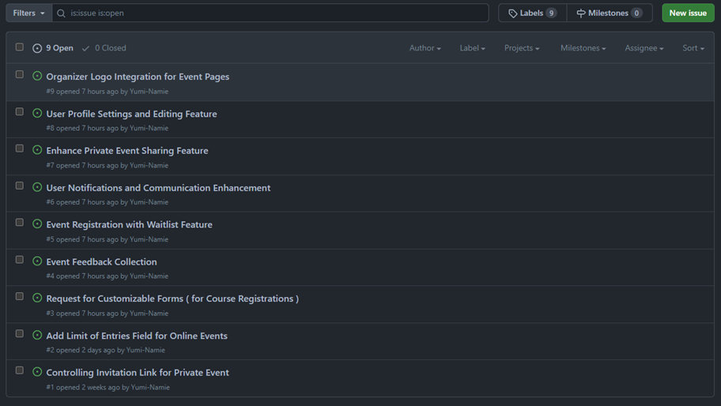

# 📅 Actos Project

## Event Registration and Attendance Application

This application has been developed to address the needs of <a href='https://www.nouscims.com/' target='_blank'>🔗 **Nous Cims Foundation** </a> in managing registration and attendance for a variety of events organized or promoted by the foundation.

We hope this application will assist in hosting successful events and delivering meaningful experiences.

## Table of Contents

- [📅 Actos Project](#-actos-project)
  - [Event Registration and Attendance Application](#event-registration-and-attendance-application)
  - [Table of Contents](#table-of-contents)
  - [🗝️ Key Features](#️-key-features)
  - [🖼️ Prototype:](#️-prototype)
  - [🛠️ Methodology and Work Tools](#️-methodology-and-work-tools)
  - [♻️ Scalable and Reusable Components](#️-scalable-and-reusable-components)
  - [📝 Event Form Properties](#-event-form-properties)
  - [📱 Responsive](#-responsive)
  - [🚀 Future Development](#-future-development)
  - [📚 Lessons Learned and Challenges Faced](#-lessons-learned-and-challenges-faced)
  - [💻 Full-stack Developers:](#-full-stack-developers)

## 🗝️ Key Features
As project goals, our objective was to complete a basic cycle of an event application: 
- Being able to create an event
- Manage an event 
- Register for an event.

## 🖼️ Prototype:
We used <a href='https://www.figma.com/file/rriSbnx6nj2DD3DLeOHcE1/Actos?type=design&node-id=24-2&mode=design&t=xw3E3MVJO3a1mU9N-0' target='_blank'>🔗 **Figma**</a> to create prototypes of our pages, which served as the foundation for developing the project and providing the client with a preview.


## 🛠️ Methodology and Work Tools
In this project, we have adopted various methodologies and used a variety of tools to ensure the efficiency and quality of development. Below, we describe how we organize our team, the tools we use at each stage of the process, and the technologies involved in our project.

| Organization        | Frontend   | Backend                    | Deploy                                          |
|---------------------|------------|----------------------------|-------------------------------------------------|
| - Scrum             | - Figma    | - MongoDB (database no-SQL)| - CI/CD (Continuous Integration and Continuous Deployment) |
| - Kanban             | - React    | - Swagger (API documentation) | - GitHub Actions (to automate CI/CD workflows directly from GitHub) |
| - Visual Studio Code | - Vite      | - Nest.js (backend framework for Node.js) | - VPS (Virtual Private Server - virtual private servers to host our applications) |
| - Zoom               | - CSS and TypeScript | - Jest (backend unit testing) 
| - Slack              | - Vitest   |                            

## ♻️ Scalable and Reusable Components
In this project, we have placed an emphasis on developing components that are both scalable and reusable across various parts of our application. This approach allows us to save time and effort by easily incorporating these components into different areas of the project, passing specific properties or functions as needed.

By adopting this strategy, we promote greater efficiency in both the development and maintenance of our application while ensuring a consistent and cohesive user experience.

Here a example of reusable components we have developed:


- icon: This property represents an optional icon or image that can be displayed within the modal. It's typically used for decorative or informational purposes to provide visual context.

- title: The title property is used to specify the main title or heading of the modal. It's usually a concise description of the modal's purpose or content.

- subtitle: Similar to title, the subtitle property allows you to include additional text below the main title. It's often used for providing more detailed information.

- button1Text: This property defines the text displayed on the first button within the modal. Typically, this button is associated with a primary action or confirmation action.

- -button2Text: Similarly, button2Text specifies the text for the second button within the modal. This button is often used for secondary actions or canceling the modal.

- onClose: The onClose property is a callback function that is triggered when the modal is closed. It allows you to define custom logic that should execute when the user closes the modal.

- isOpen: A boolean property that determines whether the modal is currently open or closed. When isOpen is true, the modal is displayed, and when it's false, the modal is hidden.

- showCloseButton: This property, when set to true, indicates that a close button 'x'should be displayed within the modal. The close button allows users to manually close the modal.

- onButton1Click: It's a callback function that gets executed when the first button (usually associated with the primary action) is clicked by the user.

- onButton2Click: Similarly, onButton2Click is a callback function executed when the second button (often associated with canceling or secondary actions) is clicked.

## 📝 Event Form Properties

Below are the basic properties of an event form, along with examples of fields to understand what each means:

- **name**: The name of the event (e.g., "Tech Conference 2023").
- **description**: A brief description of the event (e.g., "A conference on emerging technologies").
- **date**: The date of the event (e.g., "2023-11-15").
- **tags**: An array of tags related to the event (e.g., ["technology", "conference", "innovation"]).
- **category**: The category to which the event belongs (e.g., "Technology").
- **subcategory**: The subcategory within the category (e.g., "Software Development").
- **address**: The physical address of the event (e.g., "123 Main Street, City, Country").
- **startTime**: The start time of the event (e.g., "09:00").
- **endTime**: The end time of the event (e.g., "05:00").
- **timeZone**: The time zone of the event (e.g., "Madrid +2:00 GMT").
- **showDate**: Whether to display the date on the event page (e.g., true).
- **showTime**: Whether to display the time on the event page (e.g., true).
- **type**: The type of event (e.g., "Conference").
- **mode**: The mode of the event (e.g., "In-Person" or "Online").
- **image**: A link to the event's image or banner.
- **video**: A link to a promotional video for the event. - not implemented
- **capacity**: The maximum capacity for in-person attendees (e.g., 200).
- **capacityOnline**: The maximum capacity for online attendees (e.g., 500).
- **price**: The ticket price for the event (e.g., 50.0). - not implemented
- **payment**: The payment method accepted for tickets (e.g., "Credit Card" or "PayPal"). - not implemented
- **organizedBy**: An array of organizations or individuals organizing the event.
- **contactEmail**: The contact email for event-related inquiries.
- **language**: An array of languages supported by the event (e.g., ["English", "Spanish"]).
- **web**: The event's website URL.
- **visibility**: Whether the event is visible to the public (e.g., true).
- **active**: Whether the event is currently active (e.g., true).
- **customForm**: A link to a custom registration form (if applicable). 
- **form**: An object representing additional form fields.
- **isPrivate**: Whether the event is private and requires an invitation (e.g., false).
- **isLimited**: Whether there is a limit to the number of attendees (e.g., true).
- **isLimitedOnline**: Whether there is a limit to the number of online attendees (e.g., true).
- **webLink**: A link to the event's website.
- **confirmed**: Whether the event is confirmed (e.g., true).
- **qrEvent**: A QR code for the event.
- **qrAttendees**: An array of QR codes for attendees.
- **attendees**: An array of attendee IDs.
- **submitted**: An array of submitted forms or responses.
- **status**: The current status of the event (e.g., true or false).
- **subcategoryLogo**: A link to the logo of the event's subcategory.


## 📱 Responsive

Breakpoints:
```CSS
    xs: 0,
    sm: 576px,
    md: 768px,
    lg: 992px,
    xl: 1200px,
    xxl: 1400px
```

## 🚀 Future Development
To further enhance this application and provide even more value, we have identified several areas for future development. During the course of this project, we created and tracked various GitHub issues to address these potential improvements. <a href='https://github.com/raulalhena/actos-general/issues'> 🔗 GITHUB ISSUES </a>




## 📚 Lessons Learned and Challenges Faced
It was a team effort in various ways, involving different levels of expertise and skills. During the initial sprints, the project was somewhat disorganized, with poorly defined tasks that ended up affecting the project towards the end. Additionally, outside of class hours, not all team members were available, which added to the challenges.

We had numerous tasks, and we were hesitant to discard any of them, thinking that each might be important to implement. We encountered difficulties with certain components, especially when it came to styling and, more importantly, ensuring that the logic worked correctly and data was saved in the database. Lack of experience was also a contributing factor that affected our initial planning. We initially planned to use Next.js, which seemed promising for both frontend and backend development. However, midway through the project, we decided to switch to Nest.js for better scalability and because it was a framework everyone was more familiar with.

As for our learning experience, teamwork, individual commitment, patience, and empathy towards one another were key lessons. One of the major takeaways was that seemingly small tasks can take weeks or even days to complete. A collection of small tasks can be quite substantial. This was a valuable experience that we will carry with us into our professional and personal lives.

## 💻 Full-stack Developers:
Did you like our application? We'd love to hear your feedback. Please don't hesitate to get in touch with us to share your comments and suggestions. We're here to assist!

- 👧 Teresa Madridejos (Product Owner): teresamadridejosm@gmail.com
- 👩‍🦱 Renata Yumi Namie (Scrum Master): rn.yumi@gmail.com
- 👦 Raúl Alhena: raul.alhena@gmail.com
- 👦 Diego Cruz: dacmdeco779@gmail.com
- 👦 Andreu Baltazar: andreubltzr11@gmail.com


  <!-- user 651a76a3f0363ee7cbcdec5e

  event 651536d2683dc4e351f5f349
  
  fran@email.com
  Fran123@ -->